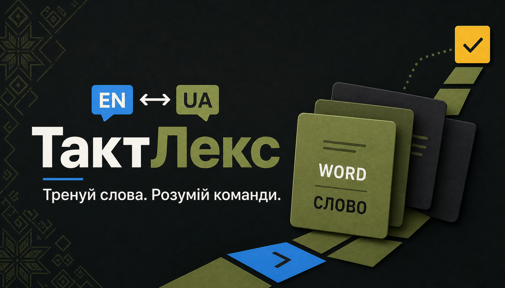

# ТактЛекс

ТактЛекс — безплатний двомовний вебтренажер військової англійської. Застосунок поєднує короткі уроки, точну серверну перевірку відповідей, детерміновані повторення, словник із джерелами та приватний прогрес. Українська — основна мова інтерфейсу; англійська доступна за префіксом `/en`.

> Це мовний продукт, а не медична чи оперативна інструкція. Seed створює лише структуру програми, ролі, правила нагород і п’ять категорій. Він не публікує неперевірені переклади.



## Що входить у MVP

- Next.js App Router на JavaScript, адаптивний інтерфейс `uk`/`en` і PWA shell;
- PostgreSQL + Prisma з SQL constraints, індексами, workflow triggers та append-only журналами;
- email/password auth з Argon2id, opaque server sessions і database-backed RBAC;
- публічні категорії, уроки, словник, джерела та повідомлення про помилки;
- адміністративний workflow `DRAFT → IN_REVIEW → APPROVED → PUBLISHED → ARCHIVED`;
- уроки на 8–12 перевірених термінів, EN → UA та UA → EN;
- серверна нормалізація відповідей і FSRS-compatible scheduling;
- XP ledger, streak, achievements, weekly/all-time opt-in leaderboards;
- metadata людського аудіо поза PostgreSQL і явно позначений Web Speech fallback;
- OpenAPI, Vitest, PostgreSQL integration tests, Playwright і GitHub Actions.

Content model містить 300 термінів у 30 уроках і 256 додаткових dictionary-only записів із наданих VTT та TCCC Ukraine — 556 словникових статей загалом. Додаткові записи доступні у словнику, але не впливають на навчальний прогрес і не створюють нових уроків. Поточний beta-реліз може бути явно позначений як неперевірений; перед звичайною публікацією переклади мають пройти предметну перевірку адміністратора.

## Вимоги

- Node.js 22.12+ або 24 LTS;
- npm 10+;
- Docker Desktop з Compose або окремий PostgreSQL 17;
- Chromium лише для локального запуску Playwright.

## Локальний запуск

```powershell
Copy-Item .env.example .env
npm ci
docker compose up -d postgres
npm run db:generate
npm run db:migrate:deploy
npm run db:seed
npm run dev
```

Відкрийте [http://localhost:3000/uk](http://localhost:3000/uk). `docker-compose.yml` створює основну базу `tactlex` і, на новому volume, disposable базу `tactlex_test`.

### Windows без Docker

Для локальної розробки на Windows доступний ізольований portable PostgreSQL 17. Він завантажується з EDB, перевіряється за SHA-256, зберігається лише в Git-ignored `.local/` і слухає `127.0.0.1:5432`:

```powershell
npm run db:local:setup
npm run db:migrate:deploy
npm run db:seed
npm run dev
```

Після перезавантаження достатньо виконати `npm run db:local:start`; зупинка — `npm run db:local:stop`, перевірка — `npm run db:local:status`. Для production використовуйте керований PostgreSQL або звичайну системну інсталяцію, а не portable dev-кластер.

Не використовуйте `prisma db push` у робочому середовищі. Історією схеми є файли в `prisma/migrations/`.

## Environment variables

| Змінна                 | Призначення                                                    |
| ---------------------- | -------------------------------------------------------------- |
| `DATABASE_URL`         | PostgreSQL URL застосунку та migration CLI                     |
| `TEST_DATABASE_URL`    | Окрема база, назва якої закінчується на `_test`                |
| `SESSION_PEPPER`       | Секрет щонайменше 32 байти для session/security digests        |
| `ALLOWED_ORIGINS`      | Точний comma-separated allowlist browser origins               |
| `NEXT_PUBLIC_APP_URL`  | Канонічний URL для metadata та browser tests                   |
| `AUDIO_STORAGE_DRIVER` | `local` у MVP; adapter також підтримує `s3` з переданим client |
| `AUDIO_STORAGE_PATH`   | Папка локальних audio objects; не зберігається в Git           |
| `ADMIN_EMAIL`          | Тимчасовий email існуючого active account для bootstrap        |

`.env.example` не містить робочих секретів. `.env`, база, uploads, Playwright artifacts і build output виключені з Git.

## Створення адміністратора

1. Запустіть seed і зареєструйте звичайний обліковий запис через UI або API.
2. Тимчасово встановіть `ADMIN_EMAIL` у середовищі процесу.
3. Виконайте `npm run admin:bootstrap`.
4. Видаліть `ADMIN_EMAIL` із середовища та увійдіть повторно.

Команда ідемпотентна, не приймає пароль і працює лише для наявного active account. Призначення ролі потрапляє в audit log.

## Перевірки

```powershell
npm run format:check
npm run lint
npm test
npm run db:validate
npm run test:integration
npm run build
npm run test:e2e -- --project=chromium
```

Integration tests пропускаються без `TEST_DATABASE_URL` і відмовляються працювати з базою, назва якої не закінчується на `_test`. Перед ними застосуйте migrations і seed до тестової бази. Повна послідовність описана в [docs/testing.md](./docs/testing.md).

## Структура

```text
src/app/                 localized pages and /api/v1 routes
src/components/          reusable UI and screens
src/features/            feature-specific browser components
src/server/services/     transactional business rules
src/server/policies/     authentication and RBAC checks
src/lib/                 database, auth, i18n, scheduling, validation
prisma/                  schema, controlled SQL migrations and seed
tests/                   unit, integration and Playwright suites
docs/                    requirements, architecture and operations
```

API повертає `{ "data": ... }` для успішної відповіді та `{ "error": { "code", "message", "requestId" } }` для помилки. Контракт для майбутнього мобільного клієнта описаний у [OpenAPI](./docs/openapi.yaml).

## Документація

- [Product requirements](./docs/product-requirements.md)
- [Implementation plan](./docs/implementation-plan.md)
- [Architecture](./docs/architecture.md)
- [Database](./docs/database.md)
- [API guide](./docs/api.md) та [OpenAPI](./docs/openapi.yaml)
- [Security](./docs/security.md)
- [Content guidelines](./docs/content-guidelines.md)
- [Testing](./docs/testing.md)
- [Deployment](./docs/deployment.md)
- [Contributing](./docs/contributing.md)
- [Architecture decisions](./docs/adr/)

## License and content rights

Код репозиторію не надає права повторно публікувати тексти, аудіо або торговельні позначення сторонніх джерел. До визначення власником окремої software license цей репозиторій слід вважати таким, що має всі права застереженими. Короткі власні визначення та точні URL джерел додаються відповідно до [content guidelines](./docs/content-guidelines.md).
