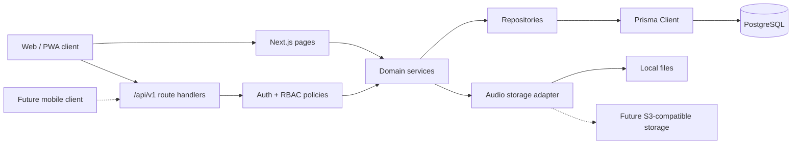

# Архітектура

## Підхід

ТактЛекс — API-first modular monolith на Next.js App Router. React відповідає за presentation, route handlers — за HTTP contract, а незалежні server services — за авторизацію й доменні правила. Та сама service layer придатна для майбутнього mobile transport adapter.



## Структура

```text
src/
  app/                    routes, layouts and route handlers
    [locale]/             bilingual UI
    api/v1/               stable JSON API
  components/             shared UI primitives and navigation
  features/               feature-specific UI and schemas
  server/
    services/             transactions and business rules
    repositories/         non-trivial data access
    policies/             authorization decisions
  lib/
    auth/                 cookie/session adapters
    db/                   Prisma singleton and transaction helpers
    i18n/                 locale configuration and messages
    scheduling/           deterministic review scheduling
    validation/           shared server schemas and normalization
  styles/
prisma/
  migrations/
  seed/
docs/
tests/
```

Repository wrappers створюються лише для запитів або транзакцій, які мають доменне значення. Прості `findUnique` не отримують зайвого abstraction layer.

## Модулі

| Модуль | Відповідальність |
| --- | --- |
| auth | registration, password hashing, login/logout, session lifecycle |
| profiles | private profile, nickname, preferences, privacy |
| content | categories, terms, variants, definitions, sources, revisions |
| reviews | moderation transitions and publication invariants |
| glossary | published search, pagination and term detail |
| learning | lesson composition, study sessions and answer checking |
| scheduling | deterministic Again/Hard/Good/Easy state transitions |
| progress | per-term and per-category aggregates |
| gamification | immutable XP ledger, streaks, levels and achievements |
| leaderboard | weekly/all-time projections with opt-in privacy |
| audio | metadata, storage adapters and TTS disclosure |
| reports | user reports and admin resolution |
| audit | append-only security and admin events |

## Request lifecycle

1. Route handler validates transport data with Zod.
2. Auth adapter resolves the opaque session and passes a trusted principal.
3. Policy enforces permission/ownership on the server.
4. Service executes domain rules and, where required, a Prisma transaction.
5. Repository reads/writes PostgreSQL.
6. Handler returns a versioned JSON envelope and maps known domain errors to stable HTTP statuses.

No endpoint accepts XP, correctness, role or achievement decisions from the client.

## i18n

- `uk` is default and `en` is supported.
- UI routes have a locale segment; API resources do not because locale is a representation concern.
- API uses a validated `locale` query/body field where localized content is needed.
- Term variants and definitions are normalized rows, not translation JSON blobs.
- Domain error codes are stable; UI translates them at the boundary.

## PWA

Manifest and service worker provide installability and cache immutable build/static assets. API requests, authenticated pages, session cookies, answer submissions and progress are network-only. The browser never becomes the source of truth for learning state.

## Audio

`audio_assets` stores locale, provider, storage key, MIME type, size, duration and attribution. A storage interface exposes read/write/delete. MVP uses a local storage directory excluded from Git and supports checked-in seed samples; an S3-compatible adapter can replace it through configuration. When no human recording exists, the client may use Web Speech API and must announce that the voice is synthetic.

## Observability and errors

- Structured application logs include request correlation id, route, result and safe actor id when useful.
- Passwords, raw tokens, cookie values, session identifiers and answer text are not logged.
- Audit records capture privileged changes and security events with redacted metadata.
- API errors use `{ error: { code, message, fieldErrors?, requestId } }` and never expose stack traces in production.

## Deployment boundary

The deliverable is a self-hostable Node.js application with PostgreSQL and optional external object storage. Docker Compose covers local PostgreSQL only. No third-party deployment is part of this task.
