# Database design

PostgreSQL is the authoritative store. Prisma describes the relational model; one reviewed SQL migration adds database features that Prisma cannot express: `citext`, `pg_trgm`, check constraints, partial/trigram/descending indexes and append-only triggers.

## Entity map

```mermaid
erDiagram
  users ||--|| user_profiles : has
  users ||--o{ user_roles : assigned
  roles ||--o{ user_roles : contains
  roles ||--o{ role_permissions : grants
  permissions ||--o{ role_permissions : belongs
  users ||--o{ auth_sessions : owns

  terms ||--o{ term_variants : has
  terms ||--o{ term_definitions : has
  terms ||--o{ term_categories : classified
  categories ||--o{ term_categories : contains
  terms ||--o{ term_sources : cites
  sources ||--o{ term_sources : supports
  terms ||--o{ content_reviews : reviewed
  terms ||--o{ content_revisions : revised
  terms ||--o{ audio_assets : voiced
  terms ||--o{ term_distractors : contrasts

  lessons ||--o{ lesson_terms : includes
  terms ||--o{ lesson_terms : appears
  users ||--o{ study_sessions : starts
  lessons ||--o{ study_sessions : instantiates
  study_sessions ||--o{ session_answers : records
  terms ||--o{ session_answers : tests
  users ||--o{ user_term_progress : learns
  terms ||--o{ user_term_progress : tracks
  user_term_progress ||--o{ review_logs : transitions
  users ||--o{ user_daily_activity : accumulates

  users ||--o{ xp_transactions : earns
  achievements ||--|| achievement_rules : defines
  users ||--o{ user_achievements : receives
  achievements ||--o{ user_achievements : awarded
  leaderboard_periods ||--o{ leaderboard_entries : ranks
  users ||--o{ leaderboard_entries : appears

  users ||--o{ term_reports : submits
  terms ||--o{ term_reports : concerns
  users ||--o{ audit_logs : acts
```



## Table groups

### Authentication and RBAC

- `users`: UUID, `citext` email, Argon2id hash, account state and timestamps.
- `user_profiles`: nickname, optional audience type, locale, timezone, daily goal, ranking privacy, streak counters.
- `roles`, `permissions`, `user_roles`, `role_permissions`: normalized RBAC, initially `USER` and `ADMIN` but extensible.
- `auth_sessions`: SHA-256 token digest, expiry, revocation, safe device metadata.
- `verification_tokens`, `password_reset_tokens`: digested one-time tokens; present for the model, outbound email is outside MVP.

### Content

- `categories`: localized title/description, target count, ordering and archive flag.
- `terms`: lifecycle status, difficulty, part of speech, origin flag, reviewer/publisher metadata and soft archive.
- `term_categories`: many-to-many classification with one optional primary category.
- `term_variants`: localized primary/synonym/accepted-hyphen variants and normalized value.
- `term_definitions`: localized short definition, example and context note.
- `sources`, `term_sources`: exact canonical URL, publisher/title, verification date and status.
- `content_reviews`, `content_revisions`: moderation decisions and immutable change snapshots.
- `audio_assets`: metadata and external storage key, never audio bytes.
- `term_distractors`: reviewed incorrect options for exercises.

### Learning

- `lessons`, `lesson_terms`: active 8–12-term lesson composition.
- `study_sessions`: direction, stage, status, counters, idempotency key and timestamps.
- `session_answers`: one server-evaluated answer per ordinal/idempotency key; correctness and awarded XP are server fields.
- `user_term_progress`: FSRS-compatible state, difficulty, stability, due date and aggregate accuracy.
- `review_logs`: append-only old/new scheduling snapshot for every grade.
- `user_daily_activity`: one row per user and Kyiv calendar date for XP and activity.

### Gamification and moderation

- `xp_transactions`: append-only ledger with a unique source key to prevent replay.
- `achievements`, `achievement_rules`, `user_achievements`: rule configuration and unique award per user.
- `leaderboard_periods`, `leaderboard_entries`: reproducible weekly/all-time projections.
- `term_reports`: user report lifecycle.
- `audit_logs`: append-only privileged/security event log.

## Key constraints

- UUID primary keys and `timestamptz` timestamps throughout.
- Unique `users(email)`, profile nickname normalization and RBAC join keys.
- Partial unique index on `term_variants(term_id, locale)` where `is_primary = true`.
- Published term requires a publication timestamp; service-level publication also requires primary EN/UA variants, both definitions and a verified source.
- Active lesson term count is guarded by the service because a cross-row count check cannot be a regular SQL check constraint.
- One answer ordinal and one idempotency key per session.
- One `user_term_progress` per user/term.
- One achievement per user/achievement.
- One XP source key per user to make awards idempotent.
- Ratings and state enums use explicit database enums or check constraints.

## Required indexes

- unique btree `users(email)`;
- `user_term_progress(user_id, due_at)` for due queues;
- `study_sessions(user_id, started_at desc)`;
- `review_logs(user_id, term_id, created_at desc)`;
- `term_variants(locale, normalized_value)` plus GIN trigram on `normalized_value`;
- `leaderboard_entries(period_id, xp desc)`;
- `audit_logs(actor_user_id, created_at desc)`;
- `content_reviews(term_id, status)`;
- supporting indexes for foreign keys, published glossary pagination and unexpired sessions.

## Deletion policy

Security, learning, XP, review and audit history is not cascade-deleted. Content relations use `RESTRICT` once referenced by learning data; content is archived rather than removed. Disposable one-time auth tokens cascade with their user. Join rows such as current role assignments may cascade only when deleting an otherwise unreferenced development/test user. Production account removal anonymizes personal profile fields and revokes sessions while retaining integrity of append-only events.

## Transactions and concurrency

- Lesson completion locks or uniquely identifies the source session, then writes completion, progress, daily activity, XP and achievements in one transaction.
- Answer and review submissions require a client-generated idempotency key and database unique constraint.
- Content transitions use the current status in the update predicate to prevent two moderators from skipping a state.
- Leaderboard entries are derived from the XP ledger; they are not a source of truth.

## Seed policy

Seed uses stable keys and `upsert`, so a second run does not create duplicates. It creates permissions, roles, achievements, four categories, small source-backed demo content in `DRAFT`, and one lesson only when its terms meet publication requirements. It never creates an admin password. A separate bootstrap command promotes an existing account identified by `ADMIN_EMAIL`.

## Backup and restore

Development backup:

```sh
pg_dump --format=custom --no-owner --file=tactlex.dump "$DATABASE_URL"
```

Restore into an empty database:

```sh
pg_restore --clean --if-exists --no-owner --dbname="$DATABASE_URL" tactlex.dump
```

Production operators must encrypt backups, restrict access, test restores and align retention with their privacy policy. Uploaded audio storage must be backed up separately from PostgreSQL metadata.
